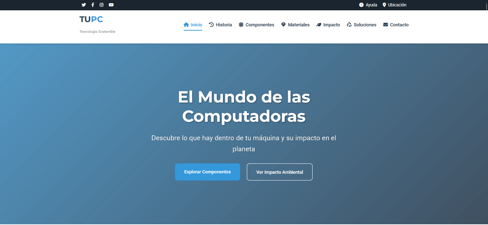
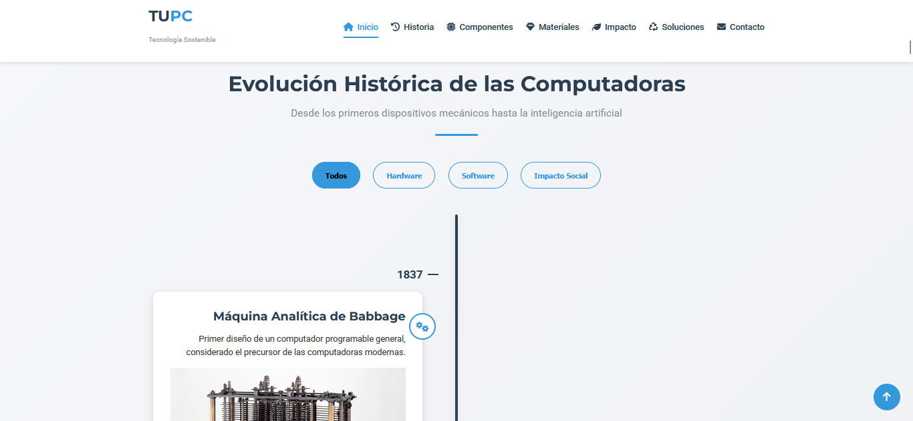
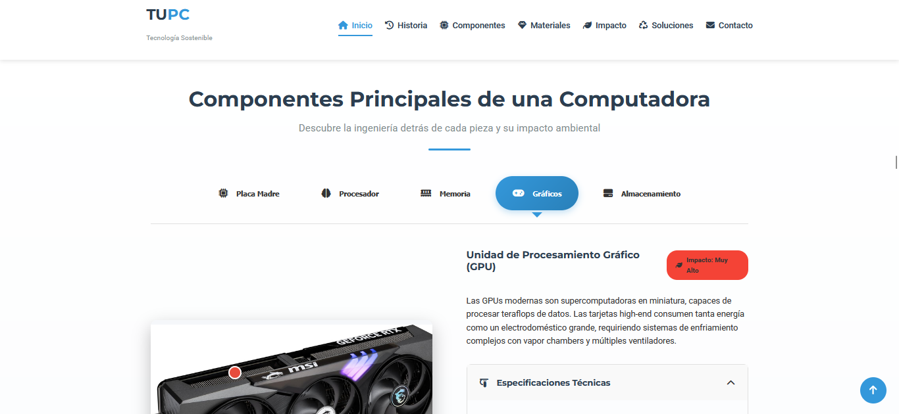
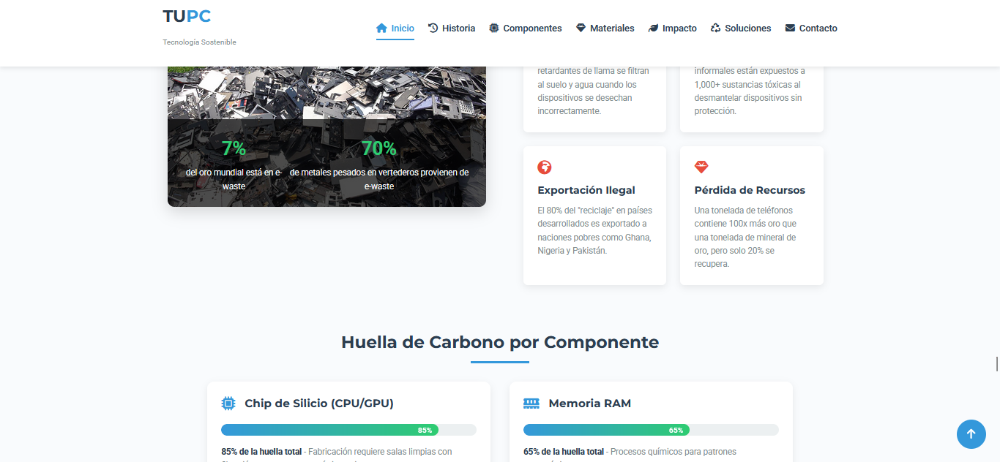
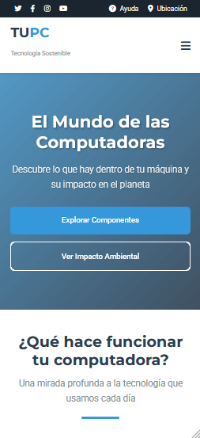
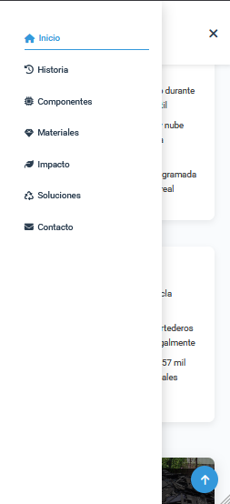

  

  

---

  

## 🚀 Descripción del Proyecto
**TUPC** es una plataforma educativa que revela el impacto ambiental oculto detrás de la tecnología que usamos diariamente. Combina:

- 🖥️ **Tecnología de hardware**  
- ♻️ **Sostenibilidad ambiental**  
- 📊 **Visualización de datos interactiva**

---

## 🌟 Características Destacadas

  <table>
    <tr>
      <td width="33%">
        <h3>🔍 Componentes Interactivos</h3>
        
        
Explora CPU, GPU y más con detalles técnicos y ecológicos

      </td>
      <td width="33%">
        <h3>📅 Línea de Tiempo</h3>
        
        
Desde el ENIAC hasta la computación cuántica

      </td>
      <td width="33%">
        <h3>🌱 Impacto Ambiental</h3>
        
        
Huella ecológica de dispositivos electrónicos

      </td>
    </tr>
  </table>

---

## 🛠 Tecnologías Utilizadas

  
  
  
  
  

---

## 📚 Recursos Educativos
📑 Guía de reciclaje electrónico
🌍 Calculadora de huella de carbono
✍️ Blog sobre tecnología verde

---

## 📸 Vista Previa del Sitio

  <h3>✨ Recorrido Visual por TUPC</h3>
  
  <!-- Fila 1 -->
  

    
    
  

  
  <!-- Fila 2 -->
  

    
    
  

  
<em>▼ Interfaz responsive en diferentes secciones ▼</em>

    <!-- Fila 3 -->
  

    
    
  

---
## ✨ Autor

  

   

 © 2025 TUPC - Tecnología con Conciencia Ecológica 
 

---
